# MotoSerwis 🛠️🏍️

**MotoSerwis** to aplikacja webowa do zarządzania serwisem motocyklowym.  
Umożliwia pracownikowi serwisu (mechanikowi) zakładanie kont, obsługę klientów i prowadzenie historii napraw motocykli.

Projekt został wykonany jako praca indywidualna na przedmiot **„Programowanie Obiektowe”** i spełnia wymagania dotyczące pracy z relacyjną bazą danych, logiką biznesową, walidacją oraz projektowaniem interfejsu użytkownika.

---

## 🧰 Technologie

- **Blazor Server (ASP.NET Core 8)**
- **Entity Framework Core**
- **SQL Server + SQL Server Management Studio**
- **ASP.NET Identity**

---

## ▶️ Instrukcja uruchomienia aplikacji

1. **Wymagania:**
   - Visual Studio 2022
   - SQL Server + SSMS
   - .NET 8 SDK

2. **Pobranie projektu:**
   - przez Git:  
     `git clone https://github.com/Shakalito/MotoSerwis-C-.git`
   - lub pobierz ZIP i otwórz plik `MotoSerwis-C-.sln` w Visual Studio

3. **Ustawienie połączenia z bazą danych:**
   - Sprawdź plik `appsettings.json`:
     ```json
     "ConnectionStrings": {
       "DefaultConnection": "Server=localhost;Database=MotoSerwis;Trusted_Connection=True;TrustServerCertificate=True;"
     }
     ```
   - W razie potrzeby zmień `Server=` na swoją nazwę instancji (np. `localhost\\SQLEXPRESS`)

4. **Uruchom aplikację (`F5`)**
   - Aplikacja:
     - automatycznie stworzy bazę danych
     - wykona migracje
     - doda dane testowe (marki, modele, klienci) przez klasę `DbSeeder`

5. **Gotowe!**  
   Aplikacja działa lokalnie — możesz się zarejestrować jako mechanik i dodać klienta oraz zlecenie.

---

## 📌 Funkcjonalności aplikacji

- Rejestracja i logowanie pracownika (mechanika)
- Dodawanie klientów i zarządzanie ich danymi
- Tworzenie zleceń serwisowych z wyborem klienta, motocykla i przypisanego mechanika
- Automatyczne przypisanie daty oraz statusu zlecenia
- Filtrowanie klientów po imieniu/nazwisku
- Filtrowanie zleceń po marce/modelu motocykla
- Edycja statusu serwisu (np. „Nowe”, „Zakończone”)
- Przegląd danych mechanika oraz zmiana hasła

---

## 🧱 Struktura bazy danych

Relacyjna baza danych zawiera m.in. tabele:

- `Clients` – klienci serwisu
- `Makes` – marki motocykli
- `Models` – modele przypisane do marek
- `Services` – zlecenia serwisowe (powiązane z klientem, motocyklem, mechanikiem)

Relacje między tabelami zostały skonfigurowane za pomocą **Fluent API** w klasie `ApplicationDbContext`.

Dane testowe (klienci, marki, modele) są dodawane za pomocą klasy `DbSeeder`.

---

## ✅ Walidacja danych

Aplikacja obsługuje różne poziomy walidacji:

### 🔹 Podstawowa
- `[Required]`, `[StringLength]` – np. imię klienta, opis usterki
- `[Compare]` – hasło = potwierdzenie hasła

### 🔸 Regular Expression
- Numer VIN walidowany jest przez wzorzec:

^[A-HJ-NPR-Z0-9]{17}$


### 🔴 Asynchroniczna walidacja
- Podczas rejestracji system sprawdza w bazie, czy e-mail (login) już istnieje – jeśli tak, pokazuje komunikat:
Error: Nazwa użytkownika '...' jest już zajęta.


---

## 🖼️ Zrzuty ekranu

### 🔹 Strona główna – widok niezalogowanego użytkownika

Opis: dostępne opcje logowania i rejestracji.

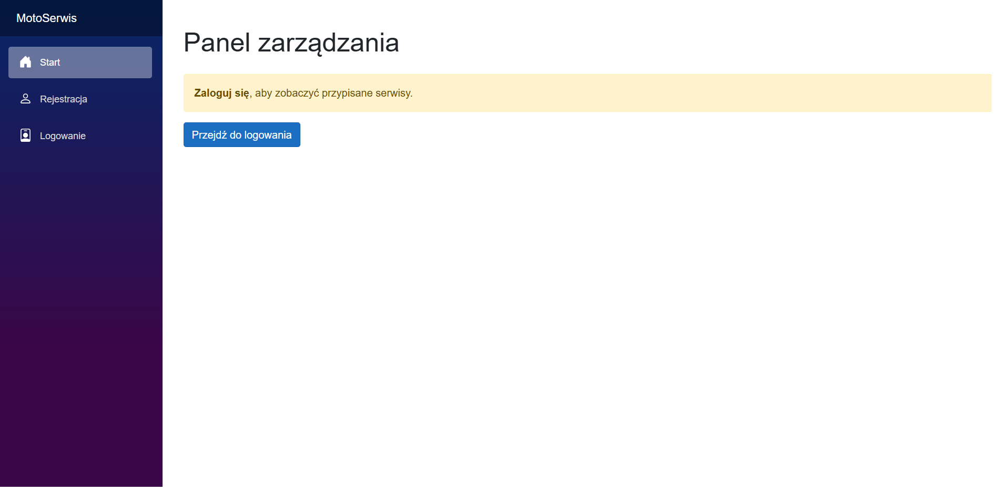

---

### 🔹 Formularz rejestracji

Opis: użytkownik podaje imię, nazwisko, e-mail i hasło.

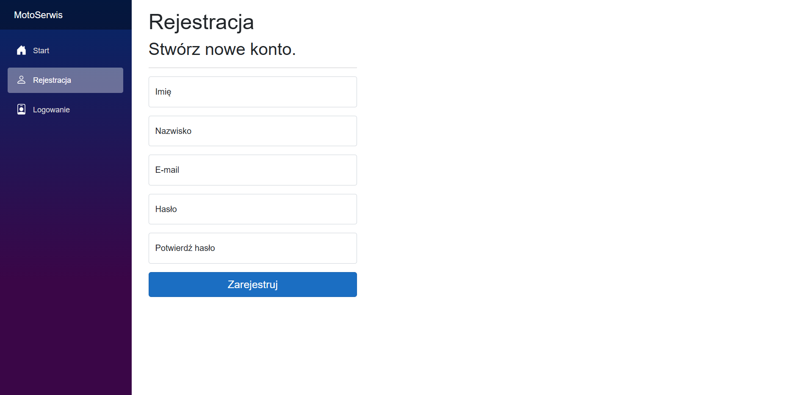

---

### 🔹 Formularz logowania

Opis: dostęp po zalogowaniu do panelu aplikacji.

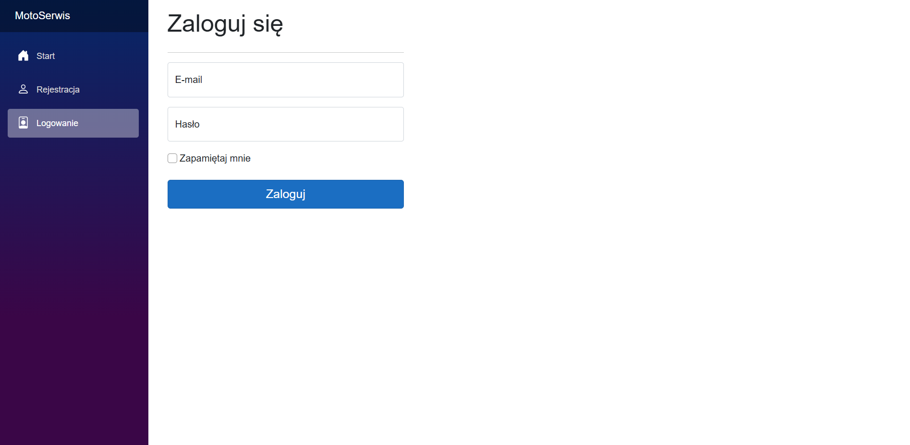

---

### 🔹 Lista klientów + filtracja

Opis: tabela klientów z możliwością wyszukiwania po imieniu/nazwisku.

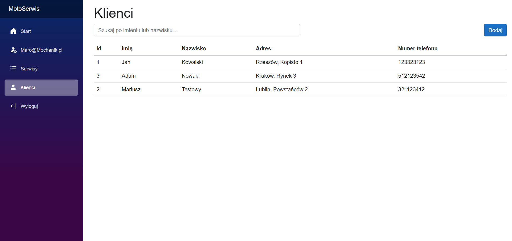

---

### 🔹 Lista serwisów + filtracja

Opis: wyświetlanie zleceń serwisowych z danymi o motocyklu, kliencie, pracowniku.

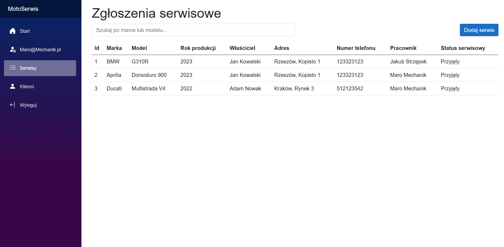

### 🔹 Dodanie nowego klienta serwisu

Opis: wyświetlanie tworzenia nowego profilu klienta

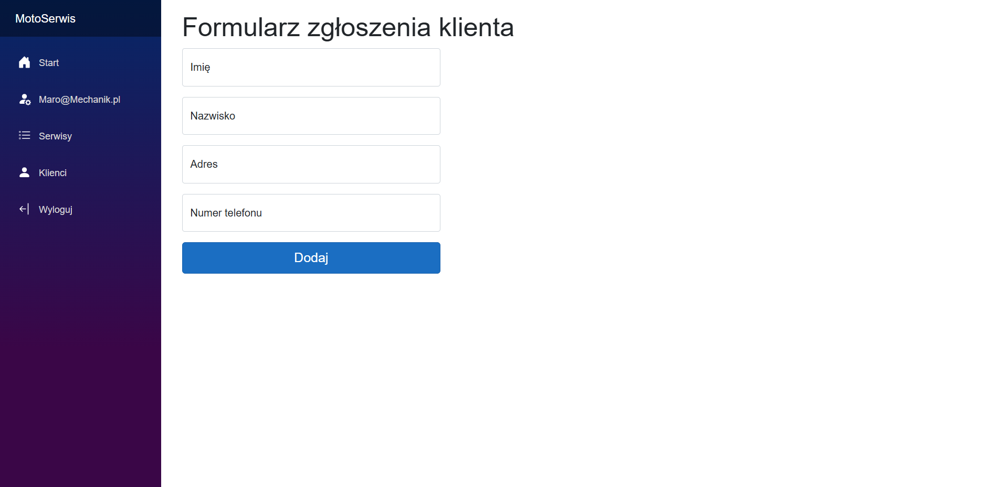

---


---

### 🔹 Dodanie nowego zgłoszenia serwisowego

Opis: wyświetlanie tworzenia nowego zlecenia serwisowego

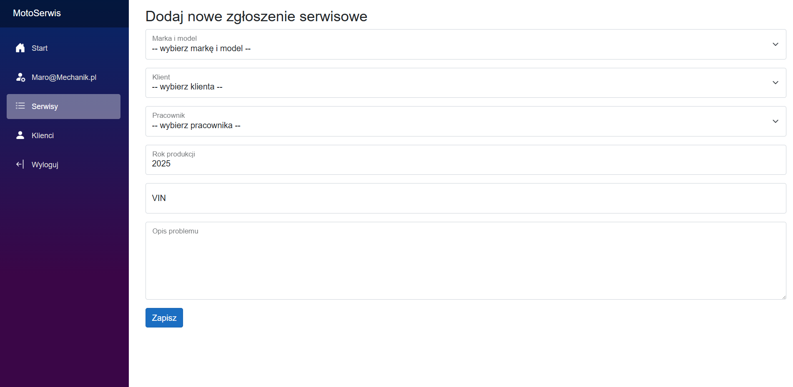

---


### 🔹 Profil zalogowanego pracownika

Opis: dane użytkownika oraz przycisk zmiany hasła.

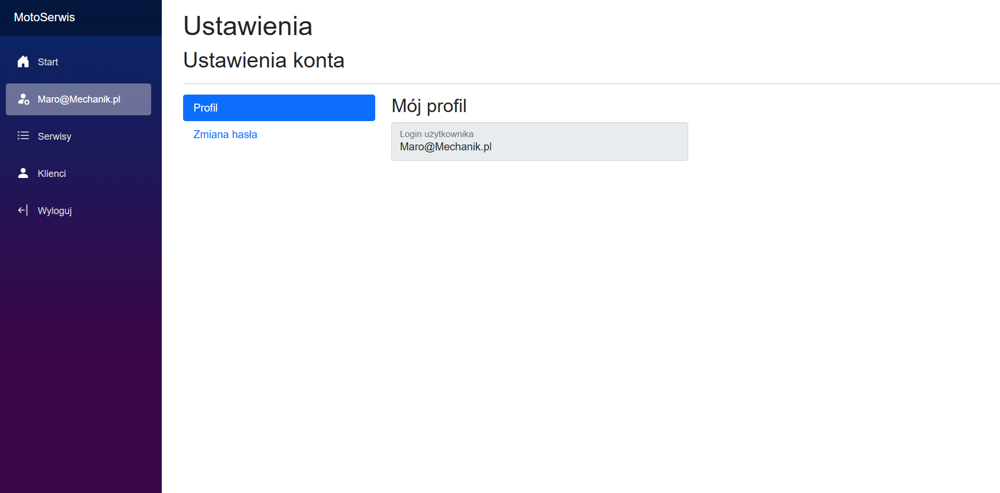

---

### 🔹 Zmiana hasła

Opis: formularz pozwalający na zmianę hasła przez pracownika.

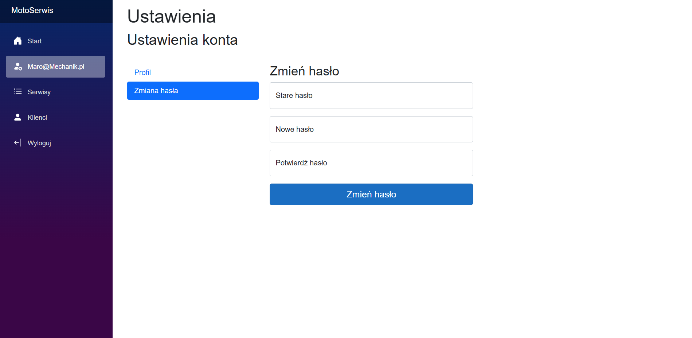

---

## ⚠️ Przypadki brzegowe i walidacja – komunikaty

### 🔸 Przykład: próba rejestracji z zajętym e-mailem
Error: Nazwa użytkownika 'Maro@Mechanik.pl' jest już zajęta.

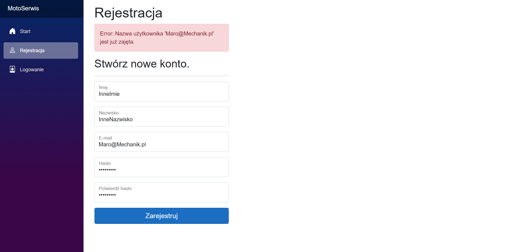


### 🔸 Przykład: puste wymagane pole
Pole imię jest wymagane.

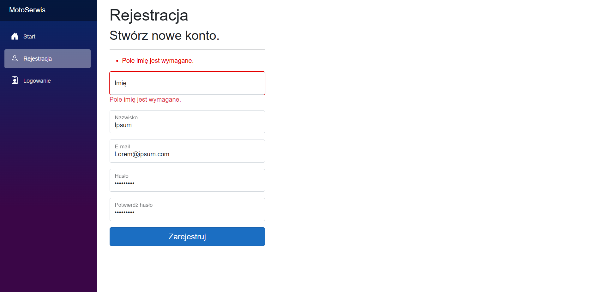

### 🔸 Przykład: nieprawidłowy VIN
VIN zawiera niedozwolone znaki.

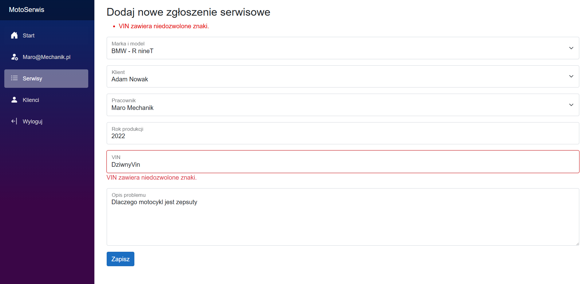

---

## Autor

Jakub Strzępek 131516  
Projekt zrealizowany w ramach zajęć **„Programowanie Obiektowe”** jako praca indywidualna.  

